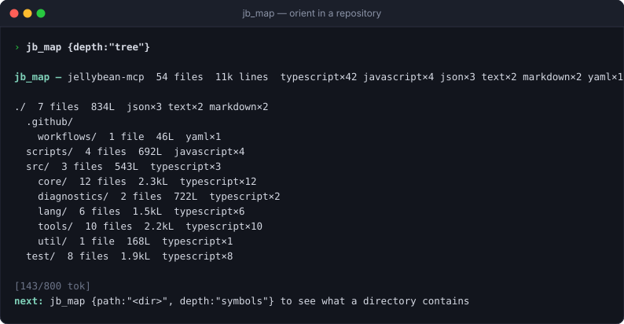
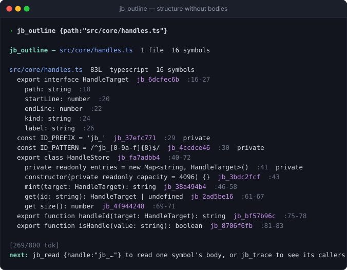
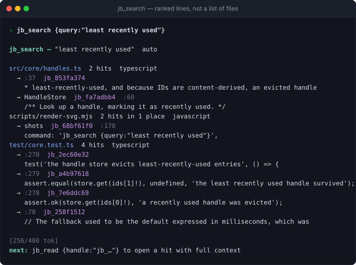
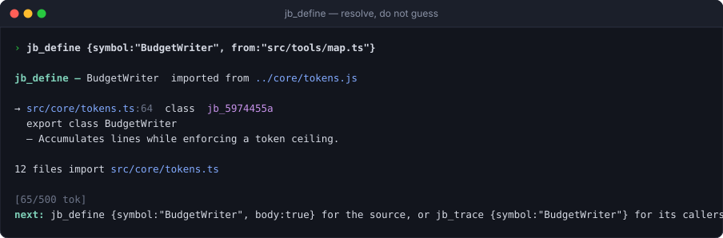
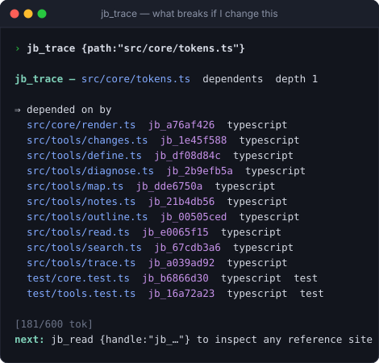

<div align="center">

# 🍬 Jelly Bean

**An MCP server that lets coding agents understand a codebase without reading it.**

Repository maps, symbol outlines, ranked search, import tracing, change review,
and parsed diagnostics — every result under a token budget it actually honours.

[](https://github.com/rayhankhilji/jellybean/actions/workflows/ci.yml)
[](https://nodejs.org)
[](LICENSE)
[](https://modelcontextprotocol.io)



</div>

---

## The problem

Most MCP servers are thin wrappers around `readFile` and `grep`. That makes them
easy to write and expensive to use. An agent asked to add a field to a service
typically burns through something like:

```
grep -rn "UserService"     →  240 matching lines, most of them imports
read src/user/service.ts   →  4,100 tokens, of which ~30 were relevant
read src/user/types.ts     →  1,800 tokens, to learn one interface
npm test                   →  3,900 lines of log for four real failures
```

Roughly 14,000 tokens to learn four facts. The context window fills with material
the model will never refer to again, and the useful signal is buried inside it.

Jelly Bean attacks this directly. Same task, same repository:

```
jb_map {focus:"user service"}          →  ~150 tokens, the five files that matter
jb_outline {path:"src/user/service.ts"} →  ~290 tokens, every declaration, no bodies
jb_read {handle:"jb_7c1e9a04"}          →  ~180 tokens, the one method
jb_diagnose {check:"test"}              →  ~220 tokens, four failures with source
```

Under 900 tokens, and the agent knows strictly more than it did above — because
it also knows what *else* is in those files, and what depends on them.

## Three ideas

Everything here follows from three decisions.

**1. Handles instead of dumps.** Every result is compact rows carrying an
identifier like `jb_7c1e9a04` that addresses an exact region of an exact file.
The agent spends tokens on a body only for the handles it chooses to follow.
Handles are content-derived, so the same region always yields the same handle —
an agent can tell that a search hit and an outline entry are the same function
without expanding either.

**2. Budgets are a contract, not a hint.** Every tool takes `tokenBudget` and
fits inside it, degrading detail rather than truncating mid-row. The footer always
reports what was omitted and names the one call that would reveal it, so a
truncated result is a signpost instead of a dead end.

**3. Structure over text.** Jelly Bean parses. It knows that a file contains a
class with nine methods, which of them are exported, which files import it, and
which of those are tests. A question about shape is answered from the index
rather than by shipping source to the model and hoping.

## Measured

Benchmarked against three real repositories, on an M-series Mac. Reproduce with
`node scripts/benchmark.mjs --markdown <repo>` — the harness picks its own
subject files from whatever repository you point it at, so the numbers are not
cherry-picked.

#### Latency

Cold is the first index of a repository. Warm is a restart with the parse cache
present, which is what a session almost always is. Tool latency is steady-state,
with the filesystem watcher running.

| Repository | Files | Cold index | Warm start | `jb_map` | `jb_outline` | `jb_search` | `jb_trace` |
|---|---|---|---|---|---|---|---|
| expressjs/express | 213 | 965ms | 100ms | 21ms | 2ms | 42ms | 4ms |
| nestjs/nest | 2,124 | 5.3s | 997ms | 22ms | 1ms | 21ms | 3ms |
| microsoft/vscode | 16,000 | 97s | 13.4s | 116ms | 1ms | 24ms | 4ms |

#### Token cost

The baseline is what an agent without these tools actually pays: reading files to
orient, and grep-then-read-the-matching-files to find a concept. Both are
measured, not assumed.

| Repository | Question | Baseline | Jelly Bean | Saved |
|---|---|---|---|---|
| express | Orient in the repo | 236,235 — read all 213 files | 749 — `jb_map` tree | **99.7%** |
| | Rank what matters | 236,235 | 1,864 — `jb_map` files | **99%** |
| | What is in `lib/utils.js`? | 1,776 — read it | 222 — `jb_outline` | **88%** |
| | Where is `contentType`? | 110,340 — grep → read 20 files | 1,992 — `jb_search` | **98%** |
| nest | Orient in the repo | 1,281,435 — read all 2,124 files | 1,875 — `jb_map` tree | **99.9%** |
| | What is in `core/injector/container.ts`? | 3,350 — read it | 1,213 — `jb_outline` | **64%** |
| | Where is `ModuleMetatype`? | 56,224 — grep → read 20 files | 1,680 — `jb_search` | **97%** |
| vscode | Orient in the repo | 66,199,497 — read all 16,000 files | 1,880 — `jb_map` tree | **99.9%** |
| | What is in `base/common/lifecycle.ts`? | 8,411 — read it | 1,899 — `jb_outline` | **77%** |
| | Where is `TRACK_DISPOSABLES`? | 110,271 — grep → read 20 files | 1,881 — `jb_search` | **98%** |

The orientation rows look almost too good, so it is worth being precise about
what they mean: nobody reads 66 million tokens, because nobody can. That is the
point. Without a map an agent reads *some* arbitrary subset and hopes it picked
the right one; the comparison is against knowing the whole shape, which is a
thing you could not previously buy at any price.

#### Honest limits

* **vscode is at the edge.** 16,000 files costs 97 seconds to index cold and
  ~580MB of heap. Warm start is 13s. Everything after that is fast, but a
  monorepo of that size is not this design's happy path.
* **The estimator is ours.** Token counts come from Jelly Bean's own estimator
  (`src/core/tokens.ts`), which deliberately over-estimates slightly. Absolute
  figures will differ a few percent from a real BPE tokenizer; the ratios will
  not.
* **Search latency depends on the query.** A term appearing in thousands of
  files costs more than a rare one, because more candidate files get read.

## Install

Requires Node 18.17 or newer. No native modules, no build step at install time,
two runtime dependencies (the MCP SDK and Zod).

### Claude Code

```bash
claude mcp add jellybean -- npx -y github:rayhankhilji/jellybean /absolute/path/to/your/repo
```

### Claude Desktop, Cursor, Windsurf, Zed

Add to your MCP configuration file:

```json
{
  "mcpServers": {
    "jellybean": {
      "command": "npx",
      "args": ["-y", "github:rayhankhilji/jellybean", "/absolute/path/to/your/repo"]
    }
  }
}
```

### From source

```bash
git clone https://github.com/rayhankhilji/jellybean.git
cd jellybean
npm install && npm run build
node dist/index.js /path/to/your/repo
```

Not yet on the npm registry, so the commands above install straight from this
repository — `npx` runs the build itself via the `prepare` script.

### Check the setup

```bash
jellybean --doctor /path/to/your/repo
```

Almost everything that goes wrong is invisible from inside an agent
conversation, so this prints what the server would actually see:

```
jellybean 1.0.0 — checking /Users/you/work/api

    ok  node            v22.11.0 on darwin
    ok  workspace       /Users/you/work/api
    ok  index           2125 files indexed in 2707 ms
    ok  file watching   active — the index updates as you edit
    ok  git             repository found — jb_changes will work
    ok  parse cache     3.1 MB at /Users/you/.cache/jellybean/63ceb474088a59d5.json
    ok  notes           /Users/you/work/api/.jellybean/notes.json
    ok  jb_diagnose     4 checks: typecheck, test, lint, build
    ok  command policy  declared checks only

Everything checks out.
```

It exits non-zero only for things that stop the server working — a missing root,
an unreadable one, or a workspace where nothing at all is indexable. A warning
means degraded, not broken: no git repository, a platform that cannot watch the
filesystem, or a repository large enough that `--max-files` truncated it. It
changes nothing while it runs.

## See it before you install it

An MCP server is awkward to evaluate: normally the only way to find out what it
does is to wire it into an agent and hope the agent chooses to call it. So there
is a guided tour that drives every tool against a real repository and prints
exactly what a model would receive:

```bash
git clone https://github.com/rayhankhilji/jellybean.git
cd jellybean && npm install
npm run demo
```

Point it at your own code, and optionally run one of your project's checks for
real:

```bash
node scripts/demo.mjs /path/to/your/repo
node scripts/demo.mjs /path/to/your/repo --check test
```

The tour ends by comparing what it printed against the cost of reading the
repository in full.

## The nine tools

### `jb_map` — orient yourself

Files ranked by structural importance: what other files import, weighted toward
being depended upon, because those are the files worth seeing first. Pass
`focus` to rank by topic instead.

```
jb_map {depth:"tree"}

jb_map — jellybean-mcp  43 files  8.1k lines  typescript×34 json×3 text×2 markdown×2 yaml×1

./  7 files  678L  json×3 text×2 markdown×2
  .github/
    workflows/  1 file  46L  yaml×1
  scripts/  1 file  44L  javascript×1
  src/  3 files  494L  typescript×3
    core/  8 files  1.4kL  typescript×8
    diagnostics/  2 files  700L  typescript×2
    lang/  6 files  1.5kL  typescript×6
    tools/  8 files  1.7kL  typescript×8
    util/  1 file  78L  typescript×1
  test/  6 files  1.4kL  typescript×6

[140/2000 tok]
next: jb_map {path:"<dir>", depth:"symbols"} to see what a directory contains
```

`depth:"files"` gives one row per file with a handle and dependent count;
`depth:"symbols"` adds each file's top-level declarations.

### `jb_outline` — structure without bodies

The single largest saving on offer. Signatures, kinds, line ranges, visibility —
and a handle for each, so the two symbols that matter can be read in full
without paying for the other forty.

```
jb_outline {path:"src/core/handles.ts"}

jb_outline — src/core/handles.ts  1 file  16 symbols

src/core/handles.ts  83L  typescript  16 symbols
  export interface HandleTarget  jb_6dcfec6b  :16-27
    path: string  :18
    startLine: number  :20
    endLine: number  :22
    kind: string  :24
    label: string  :26
  const ID_PREFIX = 'jb_'  jb_37efc771  :29  private
  const ID_PATTERN = /^jb_[0-9a-f]{8}$/  jb_4ccdce46  :30  private
  export class HandleStore  jb_fa7adbb4  :40-72
    private readonly entries = new Map<string, HandleTarget>()  :41  private
    constructor(private readonly capacity = 4096) {}  jb_3bdc2fcf  :43
    mint(target: HandleTarget): string  jb_38a494b4  :46-58
    get(id: string): HandleTarget | undefined  jb_2ad5be16  :61-67
    get size(): number  jb_4f944248  :69-71
  export function handleId(target: HandleTarget): string  jb_bf57b96c  :75-78
  export function isHandle(value: string): boolean  jb_8706f6fb  :81-83

[269/700 tok]
```



Works on a directory too, in which case it defaults to exported symbols only.

### `jb_search` — ranked lines, not a list of files

BM25 over an inverted index ranks *files*; only the top ones are read, and their
best-matching lines extracted with the symbol that encloses each. Cost does not
scale with how common your search term is.

Natural words work: identifiers are indexed whole and split, so `retry backoff`
finds `retryWithBackoff`, `RETRY_BACKOFF_MS`, and `retry_with_backoff`.

```
jb_search {query:"least recently used eviction"}

jb_search — "least recently used eviction"  auto

src/core/handles.ts  3 hits  typescript
  → :37  jb_853fa374
    * least-recently-used, and because IDs are content-derived, an evicted handle
  → HandleStore  jb_fa7adbb4  :60
    /** Look up a handle, marking it as recently used. */
src/core/tokens.ts  8 hits  typescript
  → push  jb_b7a4164c  :110
    if (this.used + cost > this.budget - this.reserved) {
  … 2 more in this file
```



`mode:"symbol"` matches declaration names only and touches no files at all.
`mode:"regex"` takes an exact pattern.

### `jb_read` — exactly the region you meant

By handle, by symbol name, or by line range.

```
jb_read {path:"src/core/handles.ts", symbol:"HandleStore.mint"}

jb_read — src/core/handles.ts:46-58  mint (method)  typescript  of 87 lines

46|   mint(target: HandleTarget): string {
47|     const id = handleId(target);
48|     // Re-inserting moves the key to the end of the Map's iteration order, which
49|     // is what makes plain Map deletion order equal to LRU order.
50|     this.entries.delete(id);
51|     this.entries.set(id, target);
52|
53|     if (this.entries.size > this.capacity) {
54|       const oldest = this.entries.keys().next();
55|       if (!oldest.done) this.entries.delete(oldest.value);
56|     }
57|     return id;
58|   }
```

When you genuinely want a whole file, `mode:"skeleton"` keeps every declaration
and elides function bodies:

```
 71| export async function runSearch(args: SearchArgs, ctx: ToolContext): Promise<string> {
   | … 84 lines
156| }
157|
165| function buildTermMatcher(query: string): RegExp {
   | … 6 lines
172| }
```

### `jb_define` — where is this actually defined?

Distinct from a name search, which ranks. This *resolves*. An agent reading
`store.load()` in a repository with five `load` declarations cannot tell from a
ranked list which one it is looking at; given `from`, this follows that file's own
import statements — through barrel re-exports — and answers precisely.

```
jb_define {symbol:"BudgetWriter", from:"src/tools/map.ts"}

jb_define — BudgetWriter  imported from ../core/tokens.js

→ src/core/tokens.ts:64  class  jb_5974455a
  export class BudgetWriter
  — Accumulates lines while enforcing a token ceiling.

12 files import src/core/tokens.ts
```



When resolution is genuinely ambiguous it says so and lists the candidates,
rather than picking one and letting the agent build on a wrong answer. Add
`body:true` for the source.

### `jb_trace` — what breaks if I change this

Walks the import graph in either direction. For a symbol it also finds the real
reference sites — a file can import a module and never touch the symbol — and
labels dependents as tests, examples, or entrypoints, because those demand
different responses from whoever is making the change.

```
jb_trace {symbol:"estimateTokens"}

jb_trace — estimateTokens in src/core/tokens.ts  dependents  depth 1

⇒ depended on by
  test/core.test.ts  6 references  test
    → :12  jb_be12ae5d
    → :13  jb_7d224441
    … 2 more
  test/tools.test.ts  4 references  test
    → :168  jb_554f50fd
```



Notes anchored to the traced file surface here automatically.

### `jb_diagnose` — problems, not logs

Runs one of the project's own checks and returns deduplicated problems with file,
line, code, and the surrounding source. Overlapping excerpts are merged and the
offending lines marked, so three type errors in one function cost one excerpt.

```
jb_diagnose {check:"typecheck"}

jb_diagnose — npm run --silent typecheck  exit 2  9.7s  3 problems

src/app.ts  7L  3 problems
  ! Argument of type 'string' is not assignable to parameter of type 'number'.  TS2345  :4:21  jb_a543cb8c
  ! Expected 2 arguments, but got 1.  TS2554  :5:18  jb_a543cb8c
  ! Cannot find name 'missingHelper'.  TS2304  :6:10  jb_a543cb8c
     2|
     3| export function run(): number {
    >4|   const total = add("one", 2);
    >5|   const scaled = scale(total);
    >6|   return missingHelper(scaled);
     7| }

[154/2000 tok]
next: jb_read {handle:"jb_…"} to open the enclosing symbol of any problem
```

Call it with no arguments to list what the project offers. Output is understood
from `tsc`, ESLint, Vitest, Jest, `cargo`, `go`, pytest, Python tracebacks,
Maven, and the `path:line:col: severity: message` convention shared by gcc,
clang, ruff, flake8, and shellcheck. Unrecognised output falls back to a generic
scan and, failing that, the tail of the log — because "no problems found" is a
dangerous answer when a command has clearly failed.

**It never invokes a shell.** See [Security](#security).

### `jb_changes` — what did I change, and what might it break?

The pre-pull-request question. A diff tells you what you typed; this tells you
what you *affected*. Changed line ranges are mapped onto the symbols containing
them, and the import graph supplies what depends on each changed file.

```
jb_changes {}

jb_changes — uncommitted  3 files  +16/-2

src/server.ts  modified  +16/-2  typescript
  · INSTRUCTIONS  constant  jb_ea9ca408  :32
  · registerTools  function  jb_37a42bce  :80

src/core/git.ts  untracked  +155/-0  typescript
  · isRepository  function  jb_47d7aff7  :34
  · changedFiles  function  jb_51700abf  :68
  · parseDiff  function  jb_fa72211c  :98
    ⇒ used by src/tools/changes.ts
```

`scope:"branch"` compares the whole branch against its base — `origin/main`,
`main`, or `master`, whichever exists, or whatever you pass as `base`. Dependents
are reported per file rather than per symbol, because the import graph records
which files import which and not which symbol each import was for; claiming
otherwise would overstate what it knows.

### `jb_notes` — findings that outlive the session

A conclusion that cost twenty tool calls should be written down, not re-derived.
Notes anchored to paths resurface in `jb_trace` on those files.

```
jb_notes {action:"add",
          text:"Retry budget is deliberately shared across shards — see transport.ts:88.",
          paths:["src/transport.ts"], tags:["gotcha"]}
```

Stored as plain JSON at `.jellybean/notes.json` inside the workspace, so a human
can read, edit, review, or commit them. An agent's accumulated understanding of a
codebase should not be locked in a private store.

## Monorepos

A monorepo is not a flat tree of files, and treating it as one loses the most
architecturally interesting fact available: which dependencies **cross a package
boundary**. Inside a package, one file importing another is unremarkable. Across
packages it is a coupling decision someone made, and the thing a reviewer
actually wants flagged.

Packages are detected from their own manifests — `package.json`, `Cargo.toml`,
`go.mod`, `pyproject.toml` — so no configuration is needed. `jb_map` reports the
count, and `jb_trace` marks the edges that matter:

```
jb_trace {path:"packages/shared/src/config.ts"}

⇒ depended on by
  packages/shared/src/local.ts   jb_1a2b3c4d  typescript
  packages/api/src/server.ts     jb_5e6f7a8b  typescript  cross-package → @acme/api
```

A repository with a single manifest is deliberately *not* treated as a monorepo.
Labelling every edge "cross-package" there would be noise on top of being wrong.

## Resources and prompts

Three resources mirror the cheapest calls, so a client that attaches resources
directly gets them without spending a tool call: `jellybean://map`,
`jellybean://checks`, `jellybean://notes`.

Two prompts encode the workflows: **onboard** (a token-efficient tour of an
unfamiliar repository) and **fix-failures** (diagnose → locate → trace → fix →
re-verify).

## Security

`jb_diagnose` is the only tool that runs anything, and its posture is explicit.

- **No shell, ever.** Commands are spawned with an argv array and `shell: false`.
  There is no globbing, no `$(…)`, no `;` chaining. A `command` of
  `echo hi; rm -rf /` runs `echo` with the literal arguments `hi;`, `rm`, `-rf`,
  `/` — which fails harmlessly.
- **Discovered checks only, by default.** Out of the box the runnable set is what
  the project declares: npm scripts, Make targets, and language defaults for
  cargo, go, pytest, and tsc. Anything else requires `--allow-command "<cmd>"`
  (prefix-matched) or the blunt `--unsafe-commands`.
- **Timeouts and output caps.** Runs are killed after 120 seconds by default and
  captured output is capped at 2 MB.
- **Path containment.** Every caller-supplied path passes through one function
  that rejects anything resolving outside the workspace root. Symlinks are not
  followed during walks — they can point outside the tree and create cycles.
- **Reads only what git would show.** `.gitignore` is honoured, including nested
  ones and negation, alongside a built-in list of directories never worth
  indexing. Binary files are detected and skipped.

Jelly Bean does no network I/O. It writes one file inside the workspace — the
notes store, and only when `jb_notes` is asked to save something — and a parse
cache outside it, under `~/.cache/jellybean/`. `jellybean --doctor` prints both
paths. [SECURITY.md](SECURITY.md) has the full picture, including the limits.

## Configuration

```
jellybean [path] [options]

  -r, --root <path>         Workspace to index. Also the first positional argument.
      --token-budget <n>    Default budget per call (default 2000).
      --max-file-bytes <n>  Skip files larger than this (default 524288).
      --max-files <n>       Stop indexing after this many files (default 20000).
      --ignore <globs>      Extra comma-separated ignore patterns.
      --allow-command <c>   Permit jb_diagnose to run this command. Repeatable.
      --unsafe-commands     Permit jb_diagnose to run any command. Off by default.
      --command-timeout <s> Seconds before a check is killed (default 120).
      --doctor              Check the setup and exit, without starting the server.
  -h, --help                Show usage.
  -v, --version             Print the version.
```

Every option has an environment equivalent: `JELLYBEAN_ROOT`,
`JELLYBEAN_TOKEN_BUDGET`, `JELLYBEAN_MAX_FILE_BYTES`, `JELLYBEAN_MAX_FILES`,
`JELLYBEAN_IGNORE`, `JELLYBEAN_ALLOW_COMMANDS`, `JELLYBEAN_UNSAFE_COMMANDS`.

## Language support

Full outlines — declarations, nesting, visibility, doc comments:

**TypeScript** · **JavaScript** (+ JSX/TSX) · **Python** · **Go** · **Rust** ·
**Java** · **Kotlin** · **Swift** · **C#** · **C** · **C++** · **Ruby** ·
**PHP** · **Shell** · **SQL** · **Markdown** · **YAML** · **TOML** · **CSS**

Import graphs are resolved for TypeScript, JavaScript, Python (including relative
`from .` imports), Go, Rust (`crate::`, `super::`, `self::`), Java, Kotlin, C#,
C/C++, Ruby, PHP, and shell.

Parsing is regex-driven over a masked copy of the source. A tree-sitter grammar
per language would mean native builds, install failures, and version drift; for
an outline that needs a name, a kind, and a line range, that is a bad trade. The
masking pass is what makes it reliable — strings, comments, template literals,
regex literals, and Python docstrings are blanked out before any pattern runs, so
a brace inside a string cannot corrupt a symbol's extent.

## Architecture

```
src/
  index.ts              CLI entry; stdio transport
  server.ts             Tool, resource, and prompt registration
  config.ts             Flags and environment
  core/
    workspace.ts        Path containment, walking, reading
    ignore.ts           .gitignore-compatible matcher
    code-index.ts       File records, inverted index, import graph
    resolver.ts         Module specifier → workspace file, per language
    handles.ts          Content-derived region references (LRU)
    cache.ts            Persistent parse cache, keyed by size and mtime
    watcher.ts          Filesystem watching, so freshness costs nothing
    git.ts              Diff and status parsing for jb_changes
    packages.ts         Monorepo package boundaries
    tokens.ts           Estimation and budget enforcement
    render.ts           The shared output grammar
    notes.ts            Persistent findings
  lang/
    scanner.ts          String/comment masking, offset-preserving
    patterns.ts         Declaration patterns per language
    outline.ts          Symbol extraction (brace / indent / line strategies)
    imports.ts          Import extraction
    registry.ts         Extension → language → syntax profile
  diagnostics/
    runner.ts           Check discovery; shell-free execution
    parsers.ts          Tool output → structured diagnostics
  tools/                One module per tool
```

Four properties of the index are worth knowing.

It is **incremental**: a rescan re-parses only files whose size or mtime changed,
so editing one file in a 5,000-file repository costs one reparse.

It is **watched**, not polled. Staying current by re-walking on a timer means
every call landing after the timer expires pays for the walk — seconds, at scale.
The watcher makes "nothing changed" free, and there is a timer fallback for
platforms where recursive watching is unavailable.

Parses are **cached to disk** under `~/.cache/jellybean`, keyed by size and
mtime, so a restart does not re-parse the repository. Deliberately outside the
workspace: notes belong in the repo, a multi-megabyte derived blob does not.

Search is **two-stage**: BM25 ranks files from the inverted index, then only the
top files are read to locate lines. Storing line-level postings would be far
larger for no ranking benefit. Exact symbol lookups skip that entirely and hit a
name index.

## Development

```bash
npm install
npm run build       # compile to dist/
npm test            # 172 tests
npm run typecheck   # no emit
npm run demo        # guided tour of every tool
npm run render      # regenerate the README's SVG renders from live output
node scripts/benchmark.mjs <repo>   # reproduce the numbers above
```

The suite covers the masking scanner (template nesting, regex-versus-division,
unterminated strings), symbol extraction across five languages, gitignore
semantics, budget enforcement, handle eviction, every diagnostic parser, and an
end-to-end pass over a real temporary workspace — plus a protocol test that
drives the built server over stdio with a real MCP client, because unit tests can
pass while a server fails to speak the protocol at all.

## Design notes

A few decisions that might look arbitrary:

**The README's screenshots are generated.** `npm run render` produces them as SVG
from real tool output, so they cannot quietly drift away from what the tools
actually print — which is the failure mode of every hand-taken screenshot. SVG
also stays diffable in git and needs no image hosting.

**Output is not JSON.** Braces, quotes, and repeated key names roughly double the
token cost of a result, and a model parses aligned rows just as reliably. The
grammar is defined once in `core/render.ts`.

**The token estimator over-estimates slightly.** A budget that is true on average
is not a contract. The estimator blends character density with symbol counting,
so `});` is charged as three tokens rather than one.

**Ambiguity is not resolution.** When the resolver cannot uniquely determine what
a specifier points at, it records an external dependency instead of guessing. A
wrong graph edge is worse than a missing one.

**The footer is written outside the budget.** Every tool reserves tokens for it.
Losing the footer to a full budget would present a truncated result as a complete
one, which is the worst failure this design can have.

## Contributing

Issues and pull requests are welcome. Adding a language usually means one entry
in `lang/registry.ts`, a pattern list in `lang/patterns.ts`, and a test in
`test/outline.test.ts` — the three strategies in `lang/outline.ts` rarely need
touching.

One rule worth knowing before you start: **if you change how anything is parsed,
bump `CACHE_VERSION` in `src/core/cache.ts`.** The cache is keyed by
(path, size, mtime) and cannot notice that our own code changed, so without a
bump you will test your fix against the old answer and conclude it did not work.

[CONTRIBUTING.md](CONTRIBUTING.md) has the rest. [CHANGELOG.md](CHANGELOG.md)
records what changed between releases, and [SECURITY.md](SECURITY.md) covers the
threat model and how to report a vulnerability.

## License

MIT © 2026 — see [LICENSE](LICENSE).
